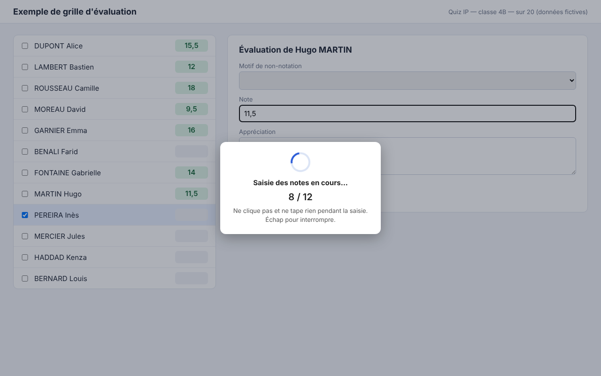

# Report de notes vers l'ENT

Extension Chrome gratuite et locale : reporte dans la grille d'évaluation de MBN les notes d'une activité Moodle. Elle ne clique jamais sur « Valider ».
Projet indépendant, non affilié à Moodle ni à MBN. Voir [la politique de confidentialité](extension/PRIVACY.md).

*(grille d'exemple, données fictives)*

Extension Chrome qui reporte dans la grille d'évaluation de MBN les notes d'une activité Moodle (quiz, devoir…).
Tout se passe dans le navigateur de l'enseignant : aucune donnée n'est envoyée à un tiers.

## Installation
1. `chrome://extensions` → activer **Mode développeur** (en haut à droite).
2. **Charger l'extension non empaquetée** → choisir ce dossier.
3. Épingler l'extension (icône puzzle → épingle).

## Première connexion
1. Clic sur l'extension → saisir l'adresse du Moodle → **Se connecter à Moodle**.
2. Accepter l'autorisation demandée par Chrome pour ce site.
3. S'identifier dans la page Moodle qui s'ouvre : elle se referme seule, une coche ✓ apparaît sur l'icône.
4. Rouvrir l'extension.

En secours : « Saisir un jeton à la main » (lien `moodlemobile://token=…` ou jeton brut).

## Utilisation
1. Choisir le **cours** et l'**activité**.
2. **1. Charger les notes depuis Moodle** : toutes les classes sont chargées d'un coup.
3. Dans MBN, ouvrir le devoir de la classe (même barème que l'activité Moodle), onglet **Évaluation**.
4. Choisir la **classe** dans l'extension → **2. Saisir dans MBN**, confirmer.
5. Lire l'alerte finale (élèves à vérifier ou à saisir à la main), vérifier la grille, puis cliquer soi-même sur **Valider** dans MBN.

Pour les classes suivantes, les notes sont déjà en mémoire : choisir la classe et cliquer sur « 2 ».

## Fonctionnement
- **Classes** : groupes Moodle « Cohorte AAAA … » de l'année la plus récente, classe = dernier mot du nom du groupe. Sans ce format, le nom complet du groupe est utilisé.
- **Rapprochement des élèves** : par nom, sans tenir compte des accents, de la casse ni de l'ordre Prénom/NOM. Les homonymes, les élèves absents de la grille et les notes non visibles après saisie sont signalés, jamais devinés.
- **Saisie** : l'extension sélectionne le premier élève, puis enchaîne note + Entrée comme à la main ; elle vérifie avant chaque saisie que le panneau de droite affiche bien l'élève sélectionné.
- **Élèves sans note dans Moodle** : laissés vides dans MBN.
- **↻ Actualiser** : relit cours, activités et classes dans Moodle (après création d'une activité, par exemple).

## Données et confidentialité
Voir `PRIVACY.md`. En bref : jeton Moodle et liste des cours/activités stockés dans l'extension ; notes et noms d'élèves en mémoire de session uniquement (effacés à la fermeture de Chrome, et classe par classe après l'envoi) ; aucune transmission à un serveur tiers.

## Limites
- L'extension ne crée pas le devoir dans MBN et ne clique jamais sur « Valider ».
- Elle dépend de la structure des pages MBN : une mise à jour de MBN peut nécessiter une adaptation.
- Le Moodle doit autoriser le service mobile (« Moodle mobile web service »).

## Navigateurs
Testée dans Chrome et Vivaldi (et tout navigateur basé sur Chromium). Dans Vivaldi, la page MBN perd le focus quand la fenêtre de l'extension se ferme : la touche Entrée simulée y serait ignorée. L'extension appelle donc directement la fonction de validation de MBN (la même que celle déclenchée par Entrée), sans autorisation supplémentaire.
